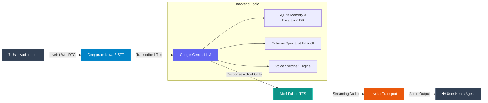

*A complete story and step-by-step guide on building an AI voice assistant for Indian banking using Murf Falcon, Deepgram Nova-3, Google Gemini, and LiveKit for the **10 Days of Voice Agents — VoiceForBharat Edition** challenge.*

---

## 1. Introduction & Story

Financial services and scheme navigation in India can be daunting. With complex application forms, intricate eligibility criteria, and digital banking menus often available only in formal English, millions of everyday citizens, elderly callers, and small business owners face barriers to accessing essential financial guidance.

To address this challenge, I built **FinAssist** — an interactive, conversational voice AI assistant developed under the **Financial Services Track** for the **10 Days of Voice Agents — VoiceForBharat Edition** challenge.


### Who is FinAssist for?
- **Everyday Banking Customers**: Looking for instant guidance on savings accounts, digital payments, UPI security, and card services.
- **Rural & Semi-Urban Citizens**: Interested in discovering government financial schemes like *PM Awas Yojana (PMAY)*, *PM Jan Dhan Yojana (PMJDY)*, *Sukanya Samriddhi Yojana (SSY)*, and *Mudra Loans*.
- **Senior Citizens & Non-Tech-Savvy Users**: Who prefer warm, natural voice conversations in native Indian scripts or code-mixed Hindi & English over complicated app UI menus.

### Why Voice?
Voice is the most natural, accessible interface in India. It bypasses literacy and tech barriers, allowing users to speak as they naturally would and receive immediate, clear, low-latency spoken responses powered by **Murf Falcon TTS**.

---

## 2. Architecture & Core Stack

FinAssist uses a modern, streaming real-time voice pipeline designed for high responsiveness and human-like natural conversation.



### Technology Stack
- **Text-to-Speech (TTS)**: [Murf Falcon](https://murf.ai/api/docs/text-to-speech/streaming) (`Pooja` and `Samar` voices) — ultra-low latency streaming voice output with natural Indian accents.
- **Speech-to-Text (STT)**: Deepgram Nova-3 (`model="nova-3", language="multi"`) — real-time transcription with multilingual and code-mixed support.
- **LLM Engine**: Google Gemini-1.5-Flash (`google.LLM`) — fast reasoning, function calling, and contextual response generation.
- **Voice Activity & Turn Detector**: Silero VAD + LiveKit Turn Detector (`MultilingualModel`) for fluid turn-taking.
- **Real-Time Transport**: LiveKit Agents SDK (`livekit-agents ~1.4`) WebRTC framework.
- **Frontend UI & Dashboard**: Next.js (React, TypeScript, Tailwind CSS) with LiveKit Agents UI and live call analytics (`/dashboard`).

---

## 3. Features Built in FinAssist

Every feature described here is genuinely implemented and tested in the codebase:

### 1. Ultra-Fast Indian Voice Output via Murf Falcon
Using Murf Falcon TTS with the `Pooja` voice (and `Samar` for scheme specialist), FinAssist speaks with realistic Indian English and Hindi context pacing, ensuring warm and relatable audio interactions.

### 2. Native Script & Code-Mixed Language Support
FinAssist strictly respects Indian native scripts (writing Hindi in Devanagari script, e.g., "नमस्ते" instead of romanized "namaste") and seamlessly supports Hindi-English code-mixed conversations.

### 3. Consent-Based Caller Memory (SQLite)
FinAssist checks for returning callers via `lookup_caller()` at session startup. Before saving any user preferences or names, the agent explicitly asks for permission (`save_caller_info`). Callers can also execute their right to be forgotten via `forget_me_tool`.

### 4. Government Scheme Eligibility Calculator
Using the `@function_tool` `check_scheme_eligibility`, FinAssist analyzes age, income bracket (`low`, `middle`, `high`), and employment status (`student`, `salaried`, `self_employed`, `retired`) to provide personalized scheme recommendations (PMAY, Jan Dhan, Mudra, SCSS, etc.).

```python
@function_tool
async def check_scheme_eligibility(
    self,
    context: RunContext,
    age: int | None = None,
    income_level: str | None = None,
    employment_type: str | None = None,
) -> str:
    """Check banking scheme eligibility based on user profile."""
    return await check_scheme_eligibility_impl(
        self, age=age, income_level=income_level, employment_type=employment_type
    )
```

### 5. Specialist Agent Handoff
When a caller asks deep queries about government schemes, the main assistant (`Assistant`) transfers control to `SchemeSpecialistAgent` ("Samar"). When general banking support is required, Samar hands the conversation back to Pooja.

### 6. Dynamic Multi-Voice Context Switching
FinAssist automatically detects whether a response is a warm greeting or a detailed scheme explanation using a custom `VoiceManager` and `VoiceSwitcher` engine, adjusting the voice profile dynamically.

```python
# Context-based voice switching logic in backend/src/voice_switcher.py
def process_message(self, text: str) -> dict:
    voice_id = self.voice_switcher.select_voice(text)
    if self.voice_switcher.is_greeting_response(text):
        voice_type = "greeting"
        style = "warm"
    elif self.voice_switcher.is_explanation_response(text):
        voice_type = "explanation"
        style = "professional"
    else:
        voice_type = "default"
        style = "neutral"
    return {"text": text, "voice_id": voice_id, "voice_type": voice_type, "style": style}
```

### 7. Human Escalation Protocol with PII Sanitization
For security emergencies or unresolved transaction disputes, FinAssist triggers `create_escalation()`. It requests explicit consent before logging a ticket (`ESC-XXXXX`), automatically sanitizes sensitive PII (card numbers, PINs, OTPs), updates duplicate tickets, and triggers optional webhook alerts.

### 8. Live Call Analytics Dashboard
A built-in Next.js dashboard (`/dashboard`) visualizes call success rates, session durations, track performance, and detailed outcome logs populated directly from SQLite database records.


---

## 4. Real Difficulty Encountered & Solution

### The Problem: PII Leakage During Escalation Logging
When users reported urgent security issues (e.g., lost card or suspicious debit), they frequently blurted out full 16-digit account numbers or 4-digit PINs during the voice prompt. Simply relying on LLM system prompt instructions was insufficient to guarantee that raw sensitive numbers wouldn't leak into database logs or external webhook notifications.

### What Was Tried
1. **Prompt Engineering Only**: Instructing Gemini in the system prompt never to record PINs/cards. While helpful, LLMs can occasionally echo caller statements verbatim in tool arguments.
2. **Simple String Truncation**: Cutting off input text, which destroyed valuable context needed by support agents.

### The Solution: Deterministic Regex Sanitization Layer
I built a dedicated Python sanitization helper (`sanitize_sensitive_info`) executed inside the `create_escalation` tool *before* any database persistence or webhook dispatch occurs:

```python
def sanitize_sensitive_info(text: str) -> str:
    """Sanitize sensitive PII such as card/account numbers, PINs, OTPs, CVVs, and passwords."""
    if not text:
        return ""
    # Mask 16-digit credit card or account numbers
    text = re.sub(
        r"\b\d{4}[-\s]?\d{4}[-\s]?\d{4}[-\s]?\d{4}\b", "[REDACTED ACCOUNT/CARD]", text
    )
    # Mask 10 to 18 digit account numbers
    text = re.sub(r"\b\d{10,18}\b", "[REDACTED ACCOUNT]", text)
    # Mask OTP, PIN, CVV, Password declarations
    text = re.sub(
        r"(?i)\b(otp|pin|cvv|password|passcode)[:\s=]*[A-Za-z0-9@#$%^&*]{3,10}\b",
        r"\1: [REDACTED]",
        text,
    )
    return text
```

This guaranteed complete PII protection while keeping issue summaries clear for human support staff.

---

## 5. Step-by-Step Guide to Run FinAssist

You can build and run your own voice AI agent using our open-source codebase.

### Public Repository
🔗 **GitHub Repository**: [https://github.com/Poojareddy327/murf-livekit-starter/tree/day10](https://github.com/Poojareddy327/murf-livekit-starter/tree/day10)

### Prerequisites
- Python 3.10+ and [`uv`](https://docs.astral.sh/uv/)
- Node.js 18+ and `pnpm`
- LiveKit Cloud account (Free Tier)
- Murf AI API Key
- Deepgram API Key
- Google Gemini API Key

### Step 1: Clone & Configure Environment Variables
```bash
git clone -b day10 https://github.com/Poojareddy327/murf-livekit-starter.git
cd murf-livekit-starter
```

Create `.env.local` files in both `backend/` and `frontend/`:

**`backend/.env.local`**:
```env
LIVEKIT_URL=wss://your-livekit-domain.livekit.cloud
LIVEKIT_API_KEY=your_livekit_api_key
LIVEKIT_API_SECRET=your_livekit_api_secret
MURF_API_KEY=your_murf_api_key
DEEPGRAM_API_KEY=your_deepgram_api_key
GOOGLE_API_KEY=your_google_gemini_api_key
```

**`frontend/.env.local`**:
```env
LIVEKIT_URL=wss://your-livekit-domain.livekit.cloud
LIVEKIT_API_KEY=your_livekit_api_key
LIVEKIT_API_SECRET=your_livekit_api_secret
```

> ⚠️ **Security Reminder**: Never commit `.env.local` files or share API keys publicly. Keep them safely stored in local environment variables or server secret managers.

### Step 2: Install & Start Backend
```bash
cd backend
uv sync
uv run python src/agent.py download-files  # First time only
uv run python src/agent.py dev
```

### Step 3: Install & Start Frontend
```bash
cd frontend
pnpm install
pnpm dev
```

### Step 4: Test Your Agent
1. Open `http://localhost:3000` in your web browser.
2. Click **Start Conversation**.
3. Speak with FinAssist in English or Hindi (e.g., *"What government schemes am I eligible for as a 25-year-old self-employed citizen?"*).
4. View real-time metrics on `http://localhost:3000/dashboard`.

---

## 6. Key Takeaways & Conclusion

Building FinAssist during the **10 Days of Voice Agents — VoiceForBharat Edition** challenge demonstrated the immense potential of voice AI for financial inclusion in India. By combining **Murf Falcon's** low-latency streaming TTS with intelligent tool calling and privacy-first guardrails, we can make essential financial services accessible to everyone, regardless of language or technological literacy.

Thank you to **Murf AI** for hosting this challenge! 🚀

---
*Built with ❤️ for #VoiceForBharat*
